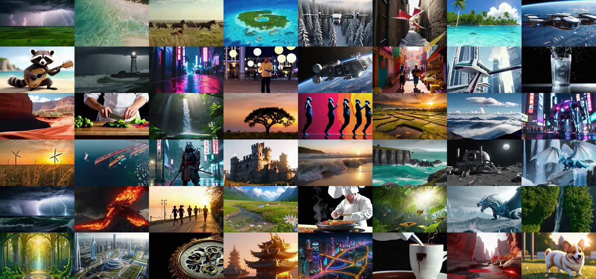
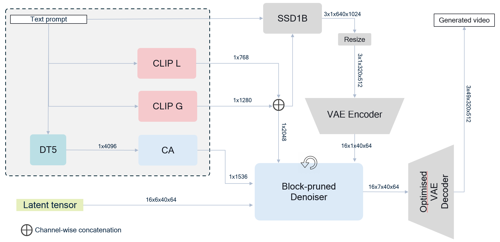

<div align="center" style="padding: 20px; border-radius: 10px;">
  <div style="display: flex; align-items: center; justify-content: center; gap: 20px;">
    
  </div>
  

  <!-- Animated banner (WebP with fallback) -->
  <picture>
    <!-- WebP first -->
    <source srcset="assets/showcase_video_banner.webp" type="image/webp">
    <!-- Optional fallback (PNG/JPEG still image or a lightweight GIF) -->
    
  </picture>
  
  <h1> Neodragon: Mobile Video Generation Using Diffusion Transformer </h1>

  <h2> <strong> ICLR 2026 </strong> </h2>
    
  <!-- Badges -->
  <a href="https://qualcomm-ai-research.github.io/neodragon">
    
  </a>
  <a href="https://arxiv.org/abs/2511.06055">
    
  </a>
  <a href="https://huggingface.co/karnewar/Neodragon">
    
  </a>
  <a href="https://openreview.net/forum?id=XBzIhhwv8d">
    
  </a>
  <a href="https://github.com/qualcomm-ai-research/neodragon">
    
  </a>


  **[Qualcomm AI Research](https://www.qualcomm.com/research/artificial-intelligence)**

  [Animesh Karnewar](https://akanimax.github.io), 
  [Denis Korzhenkov](https://scholar.google.com/citations?user=ypspak0AAAAJ), 
  [Ioannis Lelekas](https://nl.linkedin.com/in/ioannis-lelekas-609bb5151), 
  [Noor Fathima](https://scholar.google.com/citations?user=M9BUCaUAAAAJ&hl=en), 
  [Adil Karjauv](https://scholar.google.com/citations?user=bN7UGiYAAAAJ&hl=en), 
  [Hanwen Xiong](#), 
  [Vancheeswaran Vaidyanathan](https://www.linkedin.com/in/vancheeswaran-vaidyanathan), 
  [Will Zeng](https://scholar.google.com/citations?user=B_fh4ioAAAAJ&hl=en), 
  [Rafael Esteves](https://www.linkedin.com/in/rafael-esteves-124353145), 
  [Tushar Singhal](https://www.linkedin.com/in/tushar-singhal), 
  [Fatih Porikli](https://scholar.google.com/citations?user=VpB8NZ8AAAAJ&hl=en), 
  [Mohsen Ghafoorian](https://mohsenghafoorian.github.io), 
  [Amirhossein Habibian](https://habibian.github.io/)

</div>

```bibtex
@article{karnewar2025neodragon,
  author  = {Animesh Karnewar and Denis Korzhenkov and Ioannis Lelekas and Noor Fathima and Adil Karjauv and Hanwen Xiong and Vancheeswaran Vaidyanathan and Will Zeng and Rafael Esteves and Tushar Singhal and Fatih Porikli and Mohsen Ghafoorian and Amirhossein Habibian},
  title   = {Neodragon: Mobile Video Generation using Diffusion Transformer},
  journal = {arXiv preprint arXiv:2511.06055},
  year    = {2025},
  note    = {Published in the Proceedings of ICLR 2026. OpenReview: \url{https://openreview.net/forum?id=XBzIhhwv8d}; arXiv technical-report: \url{https://arxiv.org/abs/2511.06055}}
}
```

## Overview
**Neodragon** is an efficient text‑to‑video generation system that produces short, high‑fidelity videos directly from text prompts, prioritising practical, low‑latency inference and compact deployment over large‑scale offline synthesis.

## Quick Start
First, clone this repository on your machine (local / virtual), and download the [pretrained model](https://huggingface.co/karnewar/Neodragon) from huggingface under `models/Neodragon` directory. Even if you don't download the huggingface model, the code will download it the very first time you run inference. 
Then choose one of the two following ways for setting up the environment for running this code. We recommend the first `Docker` way. 

### 1. Docker way
```bash
$ DOCKER_BUILDKIT=1 BUILDKIT_PROGRESS=plain docker build -f docker/Dockerfile --pull --tag neodragon:latest .
$ docker run -ti --rm neodragon:latest
```

### 2. Virtual Env way
Create and activate a new python virtual environment for this project
```
$ python -m venv .env
$ source .env/bin/activate
(.env) $
```

Install the dependencies for running this code
```
(.env) $ pip install --no-cache-dir -r docker/requirements.txt
```

Install the neodragon project (Optional)
```
(.env) $ pip install --no-cache-dir --no-dependencies .
```

Now you are ready to run the inference on Neodragon. 

## Usage

The main script used for running inference is the one called `scripts/inference_neodragon.py`. 
```bash
$ python scripts/inference_neodragon.py -h
usage: Neodragon Video Generation Script [-h] [--model_dtype MODEL_DTYPE] [--mode {hybrid,monolithic}] [--local_cache_folder LOCAL_CACHE_FOLDER] [--prompts_file PROMPTS_FILE] [--num_samples NUM_SAMPLES] [--max_num_prompts MAX_NUM_PROMPTS] [--use_cinematic_prompt_modifier] [--profile] [--height HEIGHT]
[--width WIDTH] [--num_frames NUM_FRAMES] [--fps FPS] [--output_video_folder OUTPUT_VIDEO_FOLDER] [--safety_checker_model_id SAFETY_CHECKER_MODEL_ID] [--safety_check_num_frames SAFETY_CHECK_NUM_FRAMES] [--disable_safety_checker]

options:
  -h, --help            show this help message and exit
  --model_dtype MODEL_DTYPE
                        The Model Dtype: bf16 or fp16 or fp32. bf16 is default for fast inference
  --mode {hybrid,monolithic}
                        The Neodragon Pipeline Mode | Choices: [hybrid, monolithic]
  --local_cache_folder LOCAL_CACHE_FOLDER
                        Path to a local cache folder for storing downloaded models from HuggingFace.
  --prompts_file PROMPTS_FILE
                        Path to a `.txt` file with prompts (one per line)
  --num_samples NUM_SAMPLES
                        The number of videos to be generated per prompt
  --max_num_prompts MAX_NUM_PROMPTS
                        The number of maximum prompts to use (Helpful for Debugging)
  --use_cinematic_prompt_modifier
                        Whether to use the cinematic prompt modifier or not
  --profile             Whether to profile the generation time or not
  --height HEIGHT       The video height
  --width WIDTH         The video width
  --num_frames NUM_FRAMES
                        The number of frames in the generated video
  --fps FPS             fps of the exported videos
  --output_video_folder OUTPUT_VIDEO_FOLDER
                        The path where the generated videos should be saved
  --safety_checker_model_id SAFETY_CHECKER_MODEL_ID
                        Hugging Face model ID for the Stable Diffusion safety checker.
  --safety_check_num_frames SAFETY_CHECK_NUM_FRAMES
                        Number of generated video frames to sample for output safety checking.
  --disable_safety_checker
                        Whether to disable the Stable Diffusion safety checker.
```

Following is the generation pipeline of the **Neodragon** model
<div style="display: flex; align-items: center; justify-content: center; gap: 20px;">
  
</div><br>

As you would have already noticed, there are two modes in which the inference can be run, viz. `hybrid` and `monolithic`. The `hybrid` is the default mode in which `SSD1B` is used as the first-frame generator and the subsequent frames are generated in 1-1-1 inference (denoising) schedule, whereas in the `monolithic` mode, all the frames are generated by the DiT directly, but without the step-distilled inference schedule. In a nutshell, the default `hybrid` mode has all four of our proposed optimisations whereas the the `monolithic` mode has the first three optimisations (no step-distillation). Please refer to the paper for more details.

> #### Safety Checker
> Due to legal requirements, we incorporate the `StableDiffusionSafetyChecker` in the inference pipeline, but given our experience with VBench evaluations, the safety-checker falsely flags various generations, and crashes the vbench evaluation jobs. Hence we recommend disabling the safety-checker in this scenario via the `--disable_safety_checker` flag. 
>**Note that we do not (and legally cannot) recommend doing this for general purpose video generation. But like they say: "With great power comes great responsibility!" we trust the users to use this model responsibly.**

### Example inference runs

Most basic, single gpu process video generation in the default `hybrid` mode:
```
$ torchrun scripts/inference_neodragon.py --prompts_file prompts/showcase_prompts.txt --output_video_folder <OUTPUT_PATH>
```
Now same, but in monolithic mode:
```
$ torchrun scripts/inference_neodragon.py --mode monolithic --prompts_file prompts/showcase_prompts.txt --output_video_folder <OUTPUT_PATH>
```
The script also works with a single Node with upto 8 GPUS:
```
$ torchrun --nproc_per_node <1-to-8> scripts/inference_neodragon.py --prompts_file prompts/showcase_prompts.txt --output_video_folder <OUTPUT_PATH>
```

And, finally you can use this code to generate the vbench-videos using the following:
```
$ torchrun --nproc_per_node 8 scripts/inference_neodragon.py --prompts_file prompts/vbench_prompts.txt --output_video_folder <OUTPUT_PATH> --disable_safety_checker
```

Finally, you can create a fixed grid of the generated videos using the `make_fixed_video_grid.py` utility that we provide. 
```
$ make_fixed_video_grid.py --source_path <OUTPUT_PATH>
```

## Model Performance

We provide scripts for generating the VBench specific videos in the previous section, and point the users to the [VBench repository](https://github.com/Vchitect/VBench) which details the instructions for running the VBench suite of metrics. 


| Model              | Tot    | Qual    | Sem    | Flick.    | Aes.    | Imag.    | Obj.    | Scene    | Cons.    |
|---------------------|-------|-------|-------|-------|-------|-------|-------|-------|-------|
| **Neodragon hybrid**       | 81.61 | 83.68 | 73.36 | 99.27 | 60.71 | 59.78 | 92.37 | 56.56 | 28.09 |
| **Neodragon monolithic**      | 79.02 | 8304 | 62.97 | 99.35 | 59.75 | 64.31 | 77.86 | 49.24 | 26.27 |


The `hybrid` mode inference with this code corresponds to the main **(Ours) Neodragon E2E** score reported in the  Vbench comparison table. Refer to the paper for more details.

## Acknowledgements 

Thanks to these great repositories: [Pyramidal-Flow](https://github.com/jy0205/Pyramid-Flow), [Distil-T5](https://github.com/LifuWang-66/DistillT5/tree/main/models), [TinyVAE-HV](https://github.com/madebyollin/taehv), and many other inspiring works in the Video Generation community.

## License
**Neodragon** is licensed under the [BSD-3-clause License](https://spdx.org/licenses/BSD-3-Clause.html). See [LICENSE.txt](LICENSE.txt) for the full license text.
